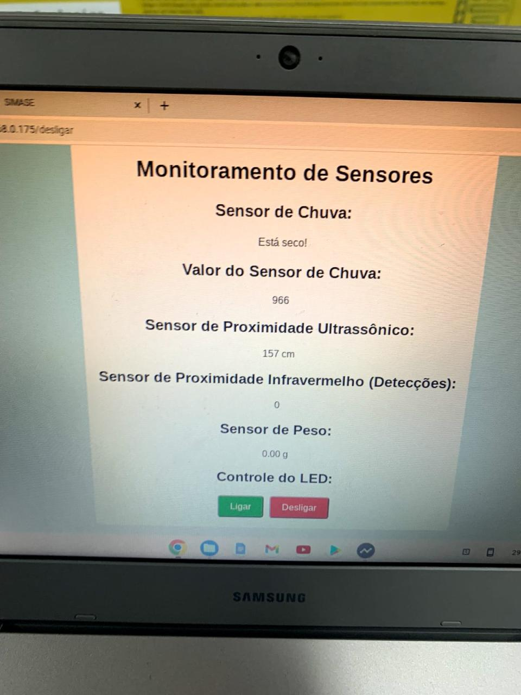

---

# Monitoramento de Apiário com Arduino e Ethernet Shield

Este projeto utiliza a linguagem de programação C++ e várias bibliotecas Arduino para desenvolver um sistema de monitoramento de apiário, com visualização de dados de sensores (proximidade e umidade) em uma página web. O sistema permite o controle de um LED e a exibição do status dos sensores em tempo real.

<p align="center">
  
</p>

## Índice

- [Descrição](#descrição)
- [Hardware Necessário](#hardware-necessário)
- [Bibliotecas Utilizadas](#bibliotecas-utilizadas)
- [Código do Projeto](#código-do-projeto)
- [Configuração e Uso](#configuração-e-uso)

## Descrição

Este sistema de monitoramento de apiário permite visualizar o status dos sensores de proximidade e chuva por meio de uma página web, utilizando o Arduino com o Ethernet Shield. Além disso, o sistema possibilita o controle de um LED remotamente.

## Hardware Necessário

- Arduino Uno ou similar
- Ethernet Shield
- Sensores:
  - Sensor de proximidade (usando pinos de **trig** e **eco**)
  - Sensor de chuva (usando o pino **sinal**)
- LED

## Bibliotecas Utilizadas

Este projeto utiliza as seguintes bibliotecas:

- **SPI.h**: Comunicação SPI para controle do Ethernet Shield.
- **Ethernet.h**: Conexão Ethernet para a criação do servidor web.
- **NewPing.h**: Controle do sensor de proximidade.
- **HX711.h**: Medição de peso (não usada no código, mas mencionada na lista de dependências).

## Código do Projeto

Aqui está o código para configurar o Arduino e o servidor web.

```cpp
#include <SPI.h>
#include <Ethernet.h>

#define sinal A0
#define trig 3
#define eco 2

byte mac[] = { 0xDE, 0xAD, 0xBE, 0xEF, 0xFE, 0xED };
byte ip[] = { 192, 168, 0, 175 };

EthernetServer server(80);

int duracao = 0;
int distancia = 0;
boolean opcao = true;
char caracter;
char opca;
boolean opc = true;
boolean op = true;
boolean opp = true;
char o;
const int ledPin = 7;

String readString = String(30);
int status = 0;

void setup() {
  Ethernet.begin(mac, ip);
  server.begin();
  pinMode(ledPin, OUTPUT);
  pinMode(trig, OUTPUT);
  pinMode(eco, INPUT);
  pinMode(sinal, INPUT);
  digitalWrite(ledPin, LOW);
  Serial.begin(9600);
}

void loop() {
  duracao = pulseIn(eco, HIGH);
  distancia = duracao * 0.017175;

  Serial.print("\n== Valor da Distancia: \n ");
  Serial.print(distancia);
  Serial.println("cm ");
  Serial.print("\n ====== \n ");
  delay(500);

  int valorSensorChuva = analogRead(sinal);
  boolean estaMolhado = (valorSensorChuva < 650 && valorSensorChuva > 0);
  boolean estaProximo = (distancia < 20);

  EthernetClient client = server.available();
  if (client) {
    while (client.connected()) {
      if (client.available()) {
        char c = client.read();
        if (readString.length() < 100) {
          readString += c;
        }
        if (c == '\n') {
          if (readString.indexOf("?") < 0) {
          } else {
            if (readString.indexOf("ledParam=1") > 0) {
              digitalWrite(ledPin, HIGH);
              status = 1;
            } else if (readString.indexOf("ledParam=0") > 0) {
              digitalWrite(ledPin, LOW);
              status = 0;
            }
            client.println("HTTP/1.1 200 OK");
            client.println("Content-Type: text/html");
            client.println();
            client.println("<!DOCTYPE HTML>");
            client.println("<html>");
            client.println("<head>");
            client.println("<link rel='icon' type='image/png' href='https://blogmasterwalkershop.com.br/arquivos/artigos/sub_wifi/logo_mws.png'/>");
            client.println("<title>Monitoramento Apiário</title>");
            client.println("</head>");
            client.println("<body style=background-color:#ADD8E6>");
            client.println("<center><font color='blue'><h1>Monitoramento Apiário</font></center></h1>");
            client.println("<h1><center>CONTROLE DE LED</center></h1>");

            client.println("<center><form method='get' name='LED'><input type='hidden' name='ledParam' value='1'/><input type='submit' value='Ligar LED'/></form></center>");
            client.println("<center><form method='get' name='LED'><input type='hidden' name='ledParam' value='0'/><input type='submit' value='Desligar LED'/></form></center>");
            client.println("<center><form method='get' name='SensorProximidade'><input type='hidden' name='sensorParam' value='1'/><input type='submit' value='Sensor de Proximidade'/></form></center>");
            client.println("<center><form method='get' name='SensorChuva'><input type='hidden' name='sensorParam' value='2'/><input type='submit' value='Sensor de Chuva'/></form></center>");

            client.print("<center><h2>Status do Sensor de Proximidade: ");
            client.print(estaProximo ? "Próximo" : "Não Próximo");
            client.println("</h2></center>");

            client.print("<center><h2>Status do Sensor de Chuva: ");
            client.print(estaMolhado ? "Molhado" : "Não Molhado");
            client.println("</h2></center>");

            client.println("<hr/>");
            client.println("</body>");
            client.println("</html>");
            readString = "";
            client.stop();
          }
        }
      }
    }
  }
}
```

## Configuração e Uso

1. **Conecte os sensores e o LED** ao Arduino conforme os pinos especificados no código.
2. **Faça o upload do código** para o Arduino usando a IDE Arduino.
3. **Acesse a página web** no navegador inserindo o endereço IP configurado no código (`192.168.0.175`).

Este projeto oferece uma interface web para monitorar o status dos sensores e controlar o LED remotamente, fornecendo uma experiência interativa para o monitoramento do apiário.

--- 
